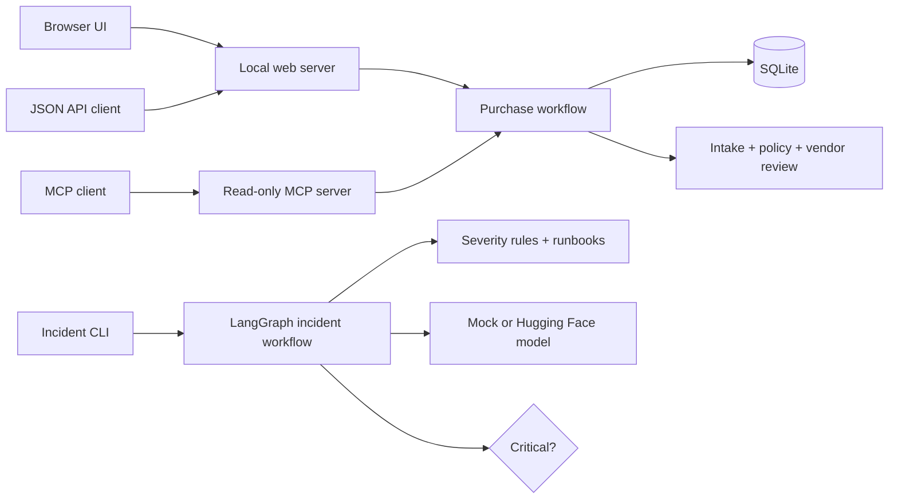
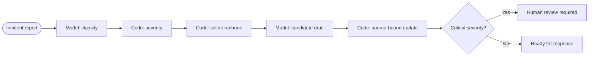

# Architecture

## System map

## Purchase request flow

```mermaid
stateDiagram-v2
    [*] --> draft: requester creates or edits
    draft --> needs_information: required data missing
    draft --> blocked: deterministic policy check fails
    draft --> awaiting_approval: review passes
    needs_information --> draft: requester updates
    blocked --> draft: requester updates
    awaiting_approval --> approved: separate approver accepts current version
    approved --> ordered: requester submits mock order
    approved --> draft: requester edits; approval is cleared
    ordered --> [*]
```

The UI and API only collect input and display results. `Workflow` in
`copilot/purchase_request_workflow.py` owns authorization and state transitions, so a client cannot
bypass permissions by calling an endpoint directly.

### Data and access boundaries

- SQLite stores requests, mock orders, and audit events.
- Every read and mutation checks the caller's department.
- Only the owner with requester role can edit, review, and order.
- Approval requires a different approver in the same department and the exact
  reviewed version.
- The MCP server operates as a configured local principal and exposes only
  request listing and inspection tools.
- Browser sign-in uses in-memory demo sessions. It illustrates application
  authorization but is not production authentication.

## Incident graph

The model is advisory. Classification is constrained to a known category, and
the model's prose does not become an operator-facing record. The final update
is constructed from graph state: the original report, calculated severity, and
the selected runbook. This prevents unsupported claims such as invented IDs,
timestamps, completed actions, root causes, or impact assessments.

## Model adapters

`MockChatModel` is the default and makes the graph reproducible without keys or
network access. `HuggingFaceChatModel` is optional, reads `HF_TOKEN` from the
shell or local `.env`, and calls the Hugging Face OpenAI-compatible chat endpoint.
No credential is stored in source control; `.env` is ignored.

## Deployment shape

`compose.yaml` builds a single Python image. The `app` service exposes port
8000 and persists SQLite data in the `purchase_request_data` named volume. The
`test` profile runs the unit suite in the same image.
