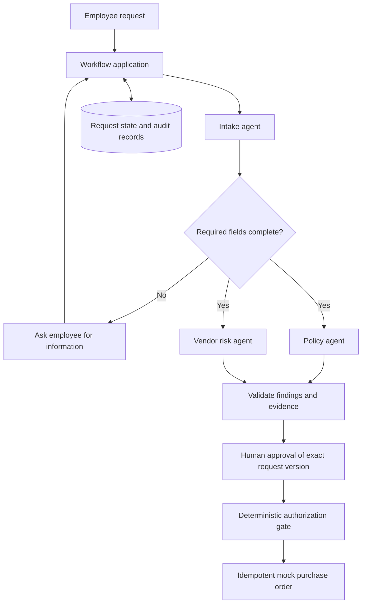

# Purchase Request Copilot — design

Status: implemented local POC with browser UI, JSON API, read-only MCP server,
and an independent LangGraph incident-triage demonstration, September 7, 2026.

## Problem and outcome

An employee requests 12 SketchFlow Pro seats at $25 per seat per month. Procurement needs complete requirements, applicable policy, existing subscription information, and vendor data-handling evidence before deciding. The copilot prepares a cited approval packet; application code controls approvals and purchases.

The portfolio demonstrates agent specialization, limited context, orchestration, persistence, authorization, and adversarial evaluation within one understandable workflow.

## Scope

Implemented: Python package, CLI demonstration, browser UI, local fixture
sessions, JSON API, SQLite persistence, deterministic simulated agents,
synthetic policies/vendors/inventory, a read-only MCP server, Docker Compose,
and regression tests. The separate incident-triage POC uses LangGraph and can
use either a deterministic model fixture or an optional Hugging Face adapter.
No external writes, real purchases, real company data, or provider credentials
are required by default.

Real vendor onboarding, payment processing, enterprise identity provisioning,
and production-grade session management remain outside this POC.

## Architecture

The application is the orchestrator, not another unconstrained agent. Independent reviews run concurrently. Agent outputs are advisory; code calculates costs, enforces budget and vendor eligibility, checks roles and ownership, and binds approval to a request version.

| Role | Context | Authority |
| --- | --- | --- |
| Intake | Structured request fields | Report missing information |
| Policy | Quantity, price, vendor, approved policy, department inventory | Return cited findings |
| Vendor risk | Customer-data flag, selected vendor evidence | Return cited findings |
| Approver | Complete approval packet within their department | Approve eligible current version |
| Order service | Approved request snapshot | Create one mock order per request/version |

The mock agents are Python functions. Explicit arguments limit accidental context exposure; this is not a process sandbox. Future agents must use server-enforced tool allowlists and independently authorized service APIs.

## Workflow and invariants

States: draft → needs_information or awaiting_approval/blocked → approved → ordered. Editing before ordering increments the version, clears findings and approval, and returns to draft. Ordered requests are immutable. A review cannot overwrite a newer request or run over an approved/ordered request.

Mandatory fields include whether customer data will be shared. Annual cost uses Decimal arithmetic with bounded seat counts and whole-cent monthly prices. Demo policy blocks annual cost above $10,000 and customer-data use without an acceptable vendor attestation. All purchases require a human approver distinct from the requester. These are synthetic company rules, not legal or regulatory guidance.

Order creation and state/audit changes share a database transaction. A unique request/version key makes retries return the same order. Read and mutation operations check department scope. Concurrent modifications are checked against the reviewed version; mutations serialize through SQLite transactions.

## Context, retrieval, and memory

Working memory is a persisted request snapshot, typed review packet, workflow state, and approval version. No conversation transcript is required by the initial workflow. Persistence lets callers resume approval/order operations after restart; the initial CLI demonstrates complete scenarios rather than providing an interactive inbox.

Initial retrieval uses exact, versioned fixture selection. Semantic search is deferred. With a vector index, apply department and document access filters before retrieval, retain document versions and section IDs, and validate returned citations against retrieved material. Define a context budget per agent; prioritize required facts and relevant passages before summarizing older conversation turns.

Long-term preference memory is deferred. Store only explicit preferences with owner, department, source, creation time, expiry, and deletion support. Previous approvals may be retrieved as history but cannot override current policy. Never store document-borne instructions as preferences.

## Model selection

Initial mock route labels exercise selection logic without invoking a model. Intake and straightforward policy review target a small model; vendor analysis involving customer data targets a stronger reasoning model. Provider/model IDs remain configuration, selected after evaluation rather than assumed in advance.

A future adapter accepts a typed context and returns schema-validated output plus provider usage and latency. Escalation triggers include invalid output after one bounded repair attempt, missing evidence, and policy contradictions. A larger model cannot resolve missing facts by guessing; request human input when evidence remains absent. Bound token budgets, tool calls, retries, timeouts, and cost per request.

Run identical cases through candidate models; compare correctness, evidence quality, escalation rate, latency, and cost. Keep deterministic rules independent of the selected model. Do not rely on self-reported confidence as the routing criterion.

## Threat model and data controls

| Threat | Initial control | Remaining work |
| --- | --- | --- |
| Vendor document injects instructions | Document is evidence only; agents have no approval/order tool; code rechecks eligibility | Adversarial evaluation of real model adapters |
| Cross-department access | Service methods enforce principal department | Authenticate principals using server-issued sessions |
| Agent invents approval | Approval exists only in application state and requires approver role | Remote tool credentials and isolated execution |
| Request changes after approval | Version increment clears approval; current version checked at order time | UI displays exact approved snapshot |
| Duplicate submission | Unique order key and atomic transaction | External API idempotency and reconciliation |
| Sensitive data in context/logs | Synthetic data; narrow agent inputs; audit events omit request body and vendor text | Redaction, encrypted storage, retention jobs, provider data settings |
| Untrusted memory | No automatic long-term memory writes | Scoped preference consent and expiry |

Keyword detection in the simulator merely supplies a visible injection demonstration. It is not a general prompt-injection defense. The durable boundary is that vendor text cannot modify permissions, policy, or approval state.

SQLite and CLI principals are local development facilities. Production requirements include authenticated identities, encrypted storage and transport, secrets management, document upload limits, malware checks, redacted telemetry, retention/deletion, backup policy, and protected audit storage. Do not claim these controls are implemented in the initial slice.

## Implemented UI, API, and MCP surfaces

The UI provides a request form, department inbox, editable missing-information
flow, readable review packet, cited evidence labels, role-aware actions, and an
audit timeline. Fixture sign-in selects Alice, Bob, or Eve and stores an
in-memory local session.

The JSON API implements create/read/update request, review, approve with
`expected_version`, and mock order submission. The same `Workflow` methods
enforce authorization and state transitions for both UI and API requests. The
MCP server provides only department-scoped request listing and inspection.

## Evaluation and delivery milestones

1. Implemented: executable mock core and four demo scenarios; tests for access isolation, separation of duties, missing facts, injected instructions, version invalidation, persistence, and idempotency.
2. Implemented: UI/API with authentication fixtures, stale-version feedback,
   editable missing-information flow, audit display, and read-only MCP access.
3. Implemented separately: LangGraph incident workflow with optional live-model
   adapter and source-bound output validation. Next: structured provider output,
   bounded retries, usage telemetry, and policy retrieval.
4. Portfolio finish: 20–30 labeled cases covering extraction, policy evidence,
   ambiguous requests, malicious documents, and tool failures; compare model
   configurations and publish measured results with a short demo recording.

Success criteria: all invariant tests pass; zero unauthorized or duplicate mock orders; model evaluation reports citation correctness, task success, cost, and latency. No model-quality numbers are claimed before real model evaluation.
